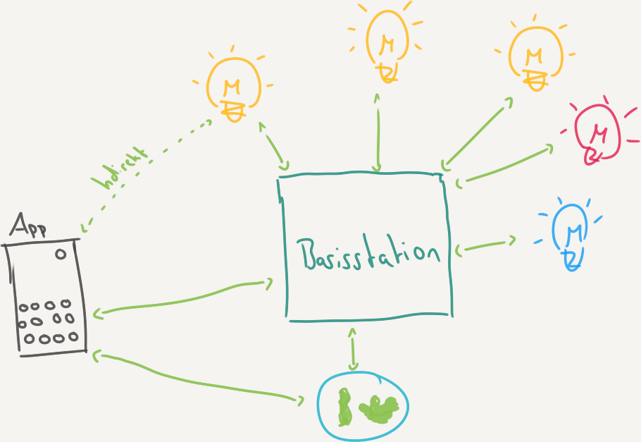

# Smartlights

Das Projekt Smartlights zeigt wie mit unterschiedlichen Werkzeugen smarte
Glühbirnensysteme wie zum Beispiel [Philips Hue](https://www2.meethue.com/),
[Yeelight](https://www.yeelight.com/home) oder
[Ikea
Tradfri](https://www.ikea.com/de/de/p/tradfri-led-leuchtmittel-e14-600-lm-kabellos-dimmbar-farb-und-weissspektrum-opalweiss-50411565/)
in den Unterricht integriert werden können. Die Systeme unterscheiden sich
grundsätzlich darin, ob eine Basisstation zur Kommunikation mit den smarten
Glühbirnen nötwendig ist oder ob sie direkt angesprochen werden können. Hier
wird sich auf die Systeme mit Basisstation fokussiert. Zusätzlich zur
Basisstation besteht das Informatiksystem Smartlights aus einen Client zum
Beispiel einer Web- oder Android-App und den smarten Glühbiren an sich.

## Komponenten

* :satellite: [Gateway (Basisstation)](gateway)
* :iphone: [Client (Web, App)](client)
* :bulb: [Light](light)

Für jede der drei Komponenten wurden verschiedene Implementierungen
entwickelt. Durch eine gemeinsame Spezifikation ist es möglich die
unterschiedlichen Komponenten beliebig auszutauschen. Zum Beispiel kann
die [Python Implementierung der Basisstation](gateway/desktop/python) mit der [Thunkable App](client/android/thunkable) und
dem [Light Simulator](light/simulator/java) kombiniert werden.
